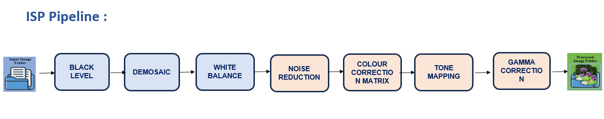
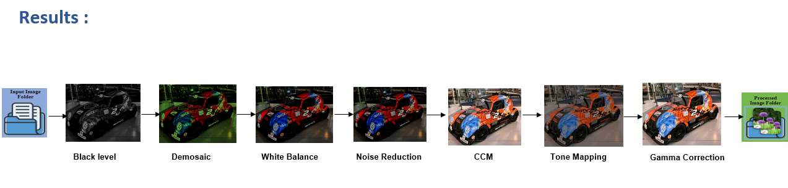

# Image-signal-processing-using-matlab-GUI

## Features
The project includes essential image signal processing steps such as color correction, demosaicing, gamma correction, denoising, Black Level Subtraction, White Balancing, and sharpening. These features collectively enhance the quality of raw image data, ensuring accurate color representation, reducing noise, and improving overall image clarity.

## Tools Used
- MATLAB

## flow diagram
   

## Image Signal Processing (ISP) Pipeline Overview

The ISP pipeline is a sequence of processing steps that convert raw sensor data from a camera into a final, visually pleasing image. Below is a brief explanation of each stage:

1. **Black Level**: This stage corrects the baseline signal level in the image, ensuring that pure black is represented as zero intensity.

2. **Demosaic**: Converts the Bayer filter mosaic captured by the sensor into a full-color image by interpolating the missing color channels.

3. **White Balance**: Adjusts the colors to ensure that white objects in the scene appear white under different lighting conditions.

4. **Noise Reduction**: Removes or reduces noise (unwanted random variations in brightness or color) from the image, improving image clarity.

5. **Color Correction Matrix (CCM)**: Applies color transformations to ensure accurate and consistent color reproduction according to standard color spaces.

6. **Tone Mapping**: Adjusts the image brightness and contrast to produce a more natural or visually pleasing image, especially in scenes with a high dynamic range.

7. **Gamma Correction**: Applies a non-linear transformation to adjust the image brightness, ensuring the image appears correctly on different display devices.

## Results

The results show the progressive transformation of an image as it passes through each stage of the ISP pipeline, from the raw input to the final processed output. The image gradually becomes clearer, with more accurate colors and improved overall quality.

## Applications
- Medical image analysis
- ADAS(Advanced Driver Assistance System) applications
- Drone camaras Cultural applications.

